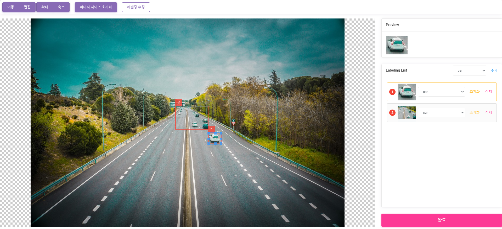

## Labeling Web Tool

* Auto Labeling System의 Labeling Tool 개발 부분
* 설명 : 머신러닝 1차 라벨링한 이미지의 라벨링을 웹에서 수정하기 위해 Cropper.js와 Cavnas를 이용하여 웹 기반 툴 개발
* 사용 기술 : HTML5(canvas), CSS,Thymeleaf, javascript, jQuery, Bootstrap, Cropper.js, MongoDB
* 주요 기능 : Labeling Box 추가, 수정, 삭제, 복사, 단축키
* GitHub : [Labeling Tool](https://github.com/minilgl/auto_labeling)

### 비고
* 단축키 수정 필요

